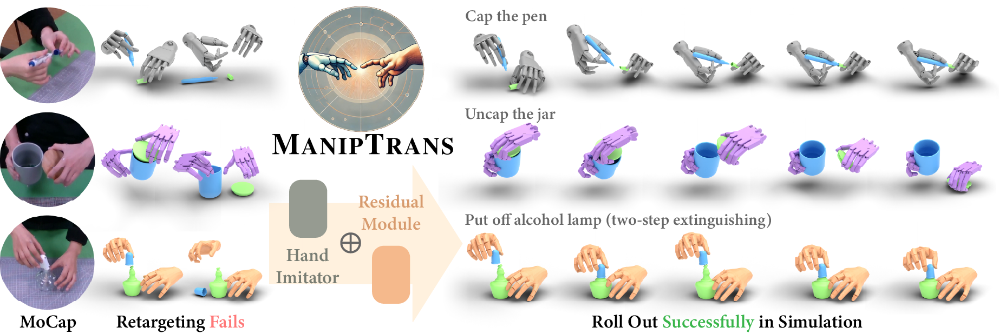

# ManipTrans: Efficient Dexterous Bimanual Manipulation Transfer via Residual Learning
<div align="center">


<p><strong>Accepted to CVPR 2025</strong></p>

[Kailin Li](https://kailinli.top),
[Puhao Li](https://xiaoyao-li.github.io/),
[Tengyu Liu](https://tengyu.ai/),
[Yuyang Li](https://yuyangli.com/),
[Siyuan Huang](https://siyuanhuang.com/)

______________________________________________________________________
</div>


<p align="center">
    <a href="https://arxiv.org/abs/2503.21860">
        </a>
    <a href='https://maniptrans.github.io/'>
        </a>
    <a href='https://huggingface.co/datasets/LiKailin/DexManipNet'>
        </a>
    <!-- <a href=""></a> -->
    
</p>

<!-- teaser image -->
<p align="center">
    
</p>

## 📑 Table of Contents
1. [Installation](#Installation)
2. [Prerequisites](#Prerequisites)
3. [Usage](#usage)
4. [🤗 Extending to New Hand-Object Datasets 🤗](#extending-to-new-hand-object-datasets)
5. [🤗 Extending to New Dexterous Hand URDF Files 🤗](#extending-to-new-dexterous-hand-urdf-files)
6. [DexManipNet Dataset](#DexManipNet)
7. [Check out Our Paper](#check-out-our-paper)
8. [Acknowledgement](#acknowledgement)
9. [License](#license)

---

## 🛠️ Installation
<a id="Installation"></a>

<details>
<summary>Steps:</summary>

1. Clone the repository and initialize submodules:
    ```bash
    git clone https://github.com/ManipTrans/ManipTrans.git
    git submodule init && git submodule update
    ```
2. Create a virtual environment named `maniptrans` with Python 3.8. Note that IsaacGym only supports Python versions up to 3.8.
    ```bash
    conda create -y -n maniptrans python=3.8
    conda activate maniptrans
    pip install torch==1.13.1+cu117 torchvision==0.14.1+cu117 torchaudio==0.13.1 --extra-index-url https://download.pytorch.org/whl/cu117
    ```
3. Download IsaacGym Preview 4 from the [official website](https://developer.nvidia.com/isaac-gym) and follow the installation instructions in the documentation. Test the installation by running an example script, such as `joint_monkey.py`, located in the `python/examples` directory.
4. Install additional dependencies.
    ```bash
    pip install git+https://github.com/ZhengyiLuo/smplx.git
    pip install git+https://github.com/KailinLi/bps_torch.git
    pip install fvcore~=0.1.5
    pip install --no-index --no-cache-dir pytorch3d==0.7.3 -f https://dl.fbaipublicfiles.com/pytorch3d/packaging/wheels/py38_cu117_pyt1131/download.html
    pip install -r requirements.txt
    pip install -e . # include the current directory in the Python path. Or use: `export PYTHONPATH=.:$PYTHONPATH`
    pip install numpy==1.23.5 # downgrade numpy to 1.23.5 to avoid compatibility issues
    ```

</details>

---

## 📋 Prerequisites
<a id="Prerequisites"></a>

<details>
<summary>Steps:</summary>

### Demo data for `Grab` dataset
1. For fair comparisons with [QuasiSim](https://github.com/Meowuu7/QuasiSim), we directly use the demo data from the official `Grab` dataset repository. Download it from the [official link](https://1drv.ms/f/s!AgSPtac7QUbHgVE5vMBOAUPzxxsV?e=B5V6mo) and extract it into the `data/grab_demo` directory.

2. Copy the demo URDF file `assets/obj_urdf_example.urdf` to `data/grab_demo/102/102_obj.urdf`.

3. The directory structure should look like this:
    ```
    data
    └── grab_demo
        └── 102
            ├── 102_obj.npy
            ├── 102_obj.obj
            ├── 102_obj.urdf
            ├── 102_sv_dict.npy
            └── 102_sv_dict_st_0_ed_108.npy
    ```

### `OakInk-V2` dataset
1. Download the OakInk-V2 dataset from its [official website](https://oakink.net/v2/) and extract it into the `data/OakInk-v2` directory. (You may skip downloading images; only annotated motion data is required.)

2. For each object mesh in `data/OakInk-v2/object_preview/align_ds`, generate the [COACD](https://github.com/SarahWeiii/CoACD) file by running:
    ```bash
    python maniptrans_envs/lib/utils/coacd_process.py -i data/OakInk-v2/object_preview/align_ds/xx/xx.obj -o data/OakInk-v2/coacd_object_preview/align_ds/xx/xx.obj --max-convex-hull 32 --seed 1 -mi 2000 -md 5 -t 0.07
    # Or, if you have the ply file, you can use:
    python maniptrans_envs/lib/utils/coacd_process.py -i data/OakInk-v2/object_preview/align_ds/xx/xx.ply -o data/OakInk-v2/coacd_object_preview/align_ds/xx/xx.ply --max-convex-hull 32 --seed 1 -mi 2000 -md 5 -t 0.07
    ```
3. For each generated COACD file in `data/OakInk-v2/coacd_object_preview/align_ds`, create a corresponding URDF file based on `assets/obj_urdf_example.urdf`.

4. Download the `body_upper_idx.pt` file from the [official website](https://oakink.net/v2/) and place it in the `data/smplx_extra` directory.

5. The directory structure should look like this:
    ```
    data
    ├── smplx_extra
    │   └── body_upper_idx.pt
    └── OakInk-v2
        ├── anno_preview
        ├── coacd_object_preview
        ├── data
        ├── object_preview
        └── program
    ```

### MISC
1. Download MANO model files from the [official website](https://mano.is.tue.mpg.de/) and extract them into the `data/mano_v1_2` directory.
2. Download the SMPL-X model files from the [official website](https://smpl-x.is.tue.mpg.de/) and extract them into the `data/body_utils/body_models` directory.

### Imitator Checkpoints
1. Download the pre-trained imitator checkpoints `imitator_ckp` from the [official website](https://huggingface.co/LiKailin/ManipTrans) and place them in the `assets` directory.

</details>

## ▶️ Usage
<a id="usage"></a>

### ✋ Training Single-Hand Policies

> **Note:** Due to licensing restrictions, we cannot provide some dexterous hand URDF files (e.g., `XHand` and `Inspire FTP`). If you have the required authorization from the respective robot companies, please contact us for configuration files.

1. **Preprocessing** (Optional but recommended)  
   Processes the trajectory to obtain a series of non-colliding, near-object states for reference state initialization (RSI), enhancing training stability and efficiency.

    ```bash
    # for Inspire Hand
    python main/dataset/mano2dexhand.py --data_idx g0 --dexhand inspire --headless --iter 2000
    ```

    <details>
    <summary>For other hands:</summary>

    ```bash
    # for Shadow Hand
    python main/dataset/mano2dexhand.py --data_idx g0 --dexhand shadow --headless --iter 3000
    # for Arti-Mano
    python main/dataset/mano2dexhand.py --data_idx g0 --dexhand artimano --headless --iter 2000
    # for Allegro Hand
    python main/dataset/mano2dexhand.py --data_idx g0 --dexhand allegro --headless --iter 4000
    # for XHand
    python main/dataset/mano2dexhand.py --data_idx g0 --dexhand xhand --headless --iter 3000
    # for Inspire FTP Hand
    python main/dataset/mano2dexhand.py --data_idx g0 --dexhand inspireftp --headless --iter 4000
    ```
    </details>


2. **Training**

    Use the following command to train single-hand policies:
    ```bash
    # for Inspire Hand
    python main/rl/train.py task=ResDexHand dexhand=inspire side=RH headless=true num_envs=4096 learning_rate=2e-4 test=false randomStateInit=true rh_base_model_checkpoint=assets/imitator_rh_inspire.pth lh_base_model_checkpoint=assets/imitator_lh_inspire.pth dataIndices=[g0] early_stop_epochs=100 actionsMovingAverage=0.4 experiment=cross_g0_inspire
    ```

    <details>
    <summary>For other hands:</summary>

    ```bash
    # for Shadow Hand (with imitator in PID-controlled mode)
    python main/rl/train.py task=ResDexHand dexhand=shadow side=RH headless=true num_envs=4096 learning_rate=2e-4 test=false randomStateInit=true rh_base_model_checkpoint=assets/imitator_pid_rh_shadow.pth lh_base_model_checkpoint=assets/imitator_pid_lh_shadow.pth dataIndices=[g0] early_stop_epochs=100 actionsMovingAverage=0.4 usePIDControl=True experiment=cross_g0_shadow_pid
    # for Arti-Mano (with imitator in PID-controlled mode)
    python main/rl/train.py task=ResDexHand dexhand=artimano side=RH headless=true num_envs=4096 learning_rate=2e-4 test=false randomStateInit=true rh_base_model_checkpoint=assets/imitator_pid_rh_artimano.pth lh_base_model_checkpoint=assets/imitator_pid_lh_artimano.pth dataIndices=[g0] early_stop_epochs=100 actionsMovingAverage=0.4 usePIDControl=True experiment=cross_g0_artimano_pid
    # for Allegro Hand (with imitator in PID-controlled mode)
    python main/rl/train.py task=ResDexHand dexhand=allegro side=RH headless=true num_envs=4096 learning_rate=2e-4 test=false randomStateInit=true rh_base_model_checkpoint=assets/imitator_pid_rh_allegro.pth lh_base_model_checkpoint=assets/imitator_pid_lh_allegro.pth dataIndices=[g0] early_stop_epochs=100 actionsMovingAverage=0.4 usePIDControl=True experiment=cross_g0_allegro_pid
    # for XHand (with imitator in PID-controlled mode)
    python main/rl/train.py task=ResDexHand dexhand=xhand side=RH headless=true num_envs=4096 learning_rate=2e-4 test=false randomStateInit=true rh_base_model_checkpoint=assets/imitator_pid_rh_xhand.pth lh_base_model_checkpoint=assets/imitator_pid_lh_xhand.pth dataIndices=[g0] early_stop_epochs=100 actionsMovingAverage=0.4 usePIDControl=True experiment=cross_g0_xhand_pid
    # for Inspire FTP Hand (with imitator in PID-controlled mode)
    python main/rl/train.py task=ResDexHand dexhand=inspireftp side=RH headless=true num_envs=4096 learning_rate=2e-4 test=false randomStateInit=true rh_base_model_checkpoint=assets/imitator_pid_rh_inspireftp.pth lh_base_model_checkpoint=assets/imitator_pid_lh_inspireftp.pth dataIndices=[g0] early_stop_epochs=100 actionsMovingAverage=0.4 usePIDControl=True experiment=cross_g0_inspireftp_pid

    # for Shadow Hand (with imitator in 6D-Force mode)
    python main/rl/train.py task=ResDexHand dexhand=shadow side=RH headless=true num_envs=4096 learning_rate=2e-4 test=false randomStateInit=true rh_base_model_checkpoint=assets/imitator_rh_shadow.pth lh_base_model_checkpoint=assets/imitator_lh_shadow.pth dataIndices=[g0] early_stop_epochs=100 actionsMovingAverage=0.4 experiment=cross_g0_shadow
    # for Arti-Mano (with imitator in 6D-Force mode)
    python main/rl/train.py task=ResDexHand dexhand=artimano side=RH headless=true num_envs=4096 learning_rate=2e-4 test=false randomStateInit=true rh_base_model_checkpoint=assets/imitator_rh_artimano.pth lh_base_model_checkpoint=assets/imitator_lh_artimano.pth dataIndices=[g0] early_stop_epochs=100 actionsMovingAverage=0.4 experiment=cross_g0_artimano
    # for Allegro Hand (with imitator in 6D-Force mode)
    python main/rl/train.py task=ResDexHand dexhand=allegro side=RH headless=true num_envs=4096 learning_rate=2e-4 test=false randomStateInit=true rh_base_model_checkpoint=assets/imitator_rh_allegro.pth lh_base_model_checkpoint=assets/imitator_lh_allegro.pth dataIndices=[g0] early_stop_epochs=100 actionsMovingAverage=0.4 experiment=cross_g0_allegro
    # for XHand (with imitator in 6D-Force mode)
    python main/rl/train.py task=ResDexHand dexhand=xhand side=RH headless=true num_envs=4096 learning_rate=2e-4 test=false randomStateInit=true rh_base_model_checkpoint=assets/imitator_rh_xhand.pth lh_base_model_checkpoint=assets/imitator_lh_xhand.pth dataIndices=[g0] early_stop_epochs=100 actionsMovingAverage=0.4 experiment=cross_g0_xhand
    # for Inspire FTP Hand (with imitator in 6D-Force mode)
    python main/rl/train.py task=ResDexHand dexhand=inspireftp side=RH headless=true num_envs=4096 learning_rate=2e-4 test=false randomStateInit=true rh_base_model_checkpoint=assets/imitator_rh_inspireftp.pth lh_base_model_checkpoint=assets/imitator_lh_inspireftp.pth dataIndices=[g0] early_stop_epochs=100 actionsMovingAverage=0.4 experiment=cross_g0_inspireftp
    ```
    </details>

    The `early_stop_epochs` is dependent on the complexity of the task. For simple tasks, you can set it to 100, while for more complex tasks (e.g. cap the pen), you may largely increase it.
3. **Test**

    After training, test the model using the following command:

    ```bash
    # for Inspire Hand
    python main/rl/train.py task=ResDexHand dexhand=inspire side=RH headless=false num_envs=4 learning_rate=2e-4 test=true randomStateInit=false rh_base_model_checkpoint=assets/imitator_rh_inspire.pth lh_base_model_checkpoint=assets/imitator_lh_inspire.pth dataIndices=[g0] actionsMovingAverage=0.4 checkpoint=runs/cross_g0_inspire__xxxxxx/nn/cross_g0_inspire.pth
    ```

    <details>
    <summary>For other hands:</summary>

    ```bash
    # for Shadow Hand (with imitator in PID-controlled mode)
    python main/rl/train.py task=ResDexHand dexhand=shadow side=RH headless=false num_envs=4 learning_rate=2e-4 test=true randomStateInit=false rh_base_model_checkpoint=assets/imitator_pid_rh_shadow.pth lh_base_model_checkpoint=assets/imitator_pid_lh_shadow.pth dataIndices=[g0] actionsMovingAverage=0.4 usePIDControl=True checkpoint=runs/cross_g0_shadow_pid__xxxxxx/nn/cross_g0_shadow_pid.pth
    # for Arti-Mano (with imitator in PID-controlled mode)
    python main/rl/train.py task=ResDexHand dexhand=artimano side=RH headless=false num_envs=4 learning_rate=2e-4 test=true randomStateInit=false rh_base_model_checkpoint=assets/imitator_pid_rh_artimano.pth lh_base_model_checkpoint=assets/imitator_pid_lh_artimano.pth dataIndices=[g0] actionsMovingAverage=0.4 usePIDControl=True checkpoint=runs/cross_g0_artimano_pid__xxxxxx/nn/cross_g0_artimano_pid.pth
    # for Allegro Hand (with imitator in PID-controlled mode)
    python main/rl/train.py task=ResDexHand dexhand=allegro side=RH headless=false num_envs=4 learning_rate=2e-4 test=true randomStateInit=false rh_base_model_checkpoint=assets/imitator_pid_rh_allegro.pth lh_base_model_checkpoint=assets/imitator_pid_lh_allegro.pth dataIndices=[g0] actionsMovingAverage=0.4 usePIDControl=True checkpoint=runs/cross_g0_allegro_pid__xxxxxx/nn/cross_g0_allegro_pid.pth
    # for XHand (with imitator in PID-controlled mode)
    python main/rl/train.py task=ResDexHand dexhand=xhand side=RH headless=false num_envs=4 learning_rate=2e-4 test=true randomStateInit=false rh_base_model_checkpoint=assets/imitator_pid_rh_xhand.pth lh_base_model_checkpoint=assets/imitator_pid_lh_xhand.pth dataIndices=[g0] actionsMovingAverage=0.4 usePIDControl=True checkpoint=runs/cross_g0_xhand_pid__xxxxxx/nn/cross_g0_xhand_pid.pth
    # for Inspire FTP Hand (with imitator in PID-controlled mode)
    python main/rl/train.py task=ResDexHand dexhand=inspireftp side=RH headless=false num_envs=4 learning_rate=2e-4 test=true randomStateInit=false rh_base_model_checkpoint=assets/imitator_pid_rh_inspireftp.pth lh_base_model_checkpoint=assets/imitator_pid_lh_inspireftp.pth dataIndices=[g0] actionsMovingAverage=0.4 usePIDControl=True checkpoint=runs/cross_g0_inspireftp_pid__xxxxxx/nn/cross_g0_inspireftp_pid.pth

    # for Shadow Hand (with imitator in 6D-Force mode)
    python main/rl/train.py task=ResDexHand dexhand=shadow side=RH headless=false num_envs=4 learning_rate=2e-4 test=true randomStateInit=false rh_base_model_checkpoint=assets/imitator_rh_shadow.pth lh_base_model_checkpoint=assets/imitator_lh_shadow.pth dataIndices=[g0] actionsMovingAverage=0.4 checkpoint=runs/cross_g0_shadow__xxxxxx/nn/cross_g0_shadow.pth
    # for Arti-Mano (with imitator in 6D-Force mode)
    python main/rl/train.py task=ResDexHand dexhand=artimano side=RH headless=false num_envs=4 learning_rate=2e-4 test=true randomStateInit=false rh_base_model_checkpoint=assets/imitator_rh_artimano.pth lh_base_model_checkpoint=assets/imitator_lh_artimano.pth dataIndices=[g0] actionsMovingAverage=0.4 checkpoint=runs/cross_g0_artimano__xxxxxx/nn/cross_g0_artimano.pth
    # for Allegro Hand (with imitator in 6D-Force mode)
    python main/rl/train.py task=ResDexHand dexhand=allegro side=RH headless=false num_envs=4 learning_rate=2e-4 test=true randomStateInit=false rh_base_model_checkpoint=assets/imitator_rh_allegro.pth lh_base_model_checkpoint=assets/imitator_lh_allegro.pth dataIndices=[g0] actionsMovingAverage=0.4 checkpoint=runs/cross_g0_allegro__xxxxxx/nn/cross_g0_allegro.pth
    # for XHand (with imitator in 6D-Force mode)
    python main/rl/train.py task=ResDexHand dexhand=xhand side=RH headless=false num_envs=4 learning_rate=2e-4 test=true randomStateInit=false rh_base_model_checkpoint=assets/imitator_rh_xhand.pth lh_base_model_checkpoint=assets/imitator_lh_xhand.pth dataIndices=[g0] actionsMovingAverage=0.4 checkpoint=runs/cross_g0_xhand__xxxxxx/nn/cross_g0_xhand.pth
    # for Inspire FTP Hand (with imitator in 6D-Force mode)
    python main/rl/train.py task=ResDexHand dexhand=inspireftp side=RH headless=false num_envs=4 learning_rate=2e-4 test=true randomStateInit=false rh_base_model_checkpoint=assets/imitator_rh_inspireftp.pth lh_base_model_checkpoint=assets/imitator_lh_inspireftp.pth dataIndices=[g0] actionsMovingAverage=0.4 checkpoint=runs/cross_g0_inspireftp__xxxxxx/nn/cross_g0_inspireftp.pth
    ```
    </details>

### 🤲 Training BiManual Policies

1. **Preprocessing**

    Preprocess data for both hands:
    ```bash
    # for Inspire Hand
    python main/dataset/mano2dexhand.py --data_idx 20aed@0 --side right --dexhand inspire --headless --iter 7000
    python main/dataset/mano2dexhand.py --data_idx 20aed@0 --side left --dexhand inspire --headless --iter 7000
    # for other hands, just replace `inspire` with the corresponding hand name
    ```
    Regarding `data_idx` of OakInk V2, for example, `20aed@0` refers to the primitive task indexed at `0` in the sequence labeled `scene_03__A004++seq__20aed35da30d4b869590__2023-04-22-18-45-27` (for simplification, we only use the first 5 digits of the hash code).

2. **Training**
  Train bi-manual policies:
    ```bash
    python main/rl/train.py task=ResDexHand dexhand=inspire side=BiH headless=true num_envs=4096 learning_rate=2e-4 test=false randomStateInit=true dataIndices=[20aed@0] rh_base_model_checkpoint=assets/imitator_rh_inspire.pth lh_base_model_checkpoint=assets/imitator_lh_inspire.pth early_stop_epochs=1000 actionsMovingAverage=0.4 experiment=cross_20aed@0_inspire
    ```
    Similar to single-hand training, the `early_stop_epochs` parameter can be adjusted based on the task complexity.

3. **Test**
  Test the bi-manual policy:
    ```bash
    python main/rl/train.py task=ResDexHand dexhand=inspire side=BiH headless=false num_envs=4 learning_rate=2e-4 test=true randomStateInit=false dataIndices=[20aed@0] rh_base_model_checkpoint=assets/imitator_rh_inspire.pth lh_base_model_checkpoint=assets/imitator_lh_inspire.pth actionsMovingAverage=0.4 checkpoint=runs/cross_20aed@0_inspire__xxxxxx/nn/cross_20aed@0_inspire.pth
    ```

---


## 🤗 Extending to New Hand-Object Datasets 🤗
<a id="extending-to-new-hand-object-datasets"></a>

We highly encourage researchers to transfer their hand-object datasets to dexterous hands using ManipTrans, contributing to the growth and development of the embodied AI community.

To facilitate this, we provide a straightforward interface to help you quickly adapt new datasets. Please refer to the examples in `main/dataset/grab_dataset_dexhand.py` and `main/dataset/oakink2_dataset_dexhand_rh.py`. It is worth mentioning that our codebase is designed for 60 FPS data. If your dataset has a lower or higher FPS, please preprocess your data; otherwise, the transfer effect may not be optimal. Please follow these steps:

1. Ensure your dataset's dataloader inherits from the `ManipData` class.  
2. Implement the `__getitem__` method in your dataloader. Ensure the returned dictionary includes the following keys:  
   - `'data_path'`  
   - `'obj_id'`  
   - `'obj_verts'`  
   - `'obj_urdf_path'`  
   - `'obj_trajectory'`  
   - `'wrist_pos'`  
   - `'wrist_rot'`  
   - `'mano_joints'`  
3. Add the handling logic for your dataset's index in the `dataset_type` function of `main/dataset/factory.py`.  

With these steps completed, you should be able to run ManipTrans on your dataset 🤗. If you encounter any issues, feel free to contact us for assistance.

---

## 🤗 Extending to New Dexterous Hand URDF Files 🤗
<a id="extending-to-new-dexterous-hand-urdf-files"></a>

We warmly welcome contributions from hardware engineers in the industry to adapt URDF files of their self-designed dexterous hands to ManipTrans. Such contributions are critical for advancing real-world dexterous manipulation applications.

To assist with this, we provide a simple interface that allows you to quickly adapt your dexterous hand URDF file. Please refer to the configuration files located in `maniptrans_envs/lib/envs/dexhands` and follow the steps below to create your own configuration:

1. Create a new configuration class that inherits from `DexHand`.  
2. Define the following essential variables in your configuration class:
   - `body_names` and `dof_names`: These should ideally follow the order from IsaacGym's definition.
   - `hand2dex_mapping`: This mapping is critical as it defines the correspondence between human hand keypoints and the joints of the dexterous hand.  
   - `contact_body_names`: The names of the body parts (e.g., fingertips) that are expected to interact with objects.  
   - `weight_idx`: A mapping of joint indices for different training weight levels:
     - `level_1_joints`: Critical joints, excluding the fingertips.  
     - `level_2_joints`: Other less-critical joints.  
   - `bone_links`: The finger connection sequence, used primarily for visualization purposes.  
   - `relative_rotation`: The rotation of the dexterous hand’s wrist relative to the MANO wrist, which needs manual adjustment.  
   - `relative_translation`: The translation of the dexterous hand’s wrist relative to the MANO wrist. If the wrist position in the URDF is at the origin, set `relative_translation` to `0`.  

After completing this configuration, you should be able to use ManipTrans with your custom-designed dexterous hand 🤗. If you encounter any issues, feel free to contact us for support. We also encourage you to share your URDF files with the community to help advance research and development in dexterous manipulation.

## 📦 `DexManipNet` Dataset
<a id="DexManipNet"></a>
<details>
<summary>Steps:</summary>

1. Download the `DexManipNet` dataset from the [official website](https://huggingface.co/datasets/LiKailin/DexManipNet) and extract it into the `data/dexmanipnet` directory.

2. For the OakInk V2 dataset, create a symbolic link from the `coacd_object_preview` directory to `data/dexmanipnet/dexmanipnet_oakinkv2/ObjURDF`, which is required for loading the URDF files. (Please refer to the [Prerequisites](#Prerequisites) section for details on generating the COACD files.)

    For the FAVOR dataset, we already provide the URDF files in `data/dexmanipnet/dexmanipnet_favor/ObjURDF`.

    After setup, your directory structure should resemble the following:
    ```
    dexmanipnet
    ├── dexmanipnet_favor
    │   ├── ObjURDF
    │   │   ├── OakInkObjectsV2
    │   │   └── OakInkVirtualObjectsV2
    │   └── sequences
    └── dexmanipnet_oakinkv2
        ├── oakinkv2_val_list.json
        ├── ObjURDF -> ../../OakInk-v2/coacd_object_preview
        │   ├── align_ds
        │   └── obj_desc.json
        └── sequences
    ```

3. To visualize the dataset, run the following example commands:
    ```bash
    # For FAVOR dataset:
    python DexManipNet/vis_dataset.py --idx 1093 --side rh --source favor

    # For OakInk V2 dataset:
    python DexManipNet/vis_dataset.py --idx 267 --side bih --source oakinkv2
    ```

    Detailed descriptions and task names can be found in the `seq_info.json` file within each sequence directory.

4. If you find our dataset `DexManipNet` helpful, please also consider citing OakInk V2 and FAVOR to acknowledge their contributions:
    <details>
    <summary>OakInk V2</summary>

    ```bibtex
        @inproceedings{zhan2024oakink2,
            title={Oakink2: A dataset of bimanual hands-object manipulation in complex task completion},
            author={Zhan, Xinyu and Yang, Lixin and Zhao, Yifei and Mao, Kangrui and Xu, Hanlin and Lin, Zenan and Li, Kailin and Lu, Cewu},
            booktitle={Proceedings of the IEEE/CVF Conference on Computer Vision and Pattern Recognition},
            year={2024}
        }
    ```
    </details>

    <details>
    <summary>FAVOR</summary>

    ```bibtex
        @inproceedings{li2024favor,
            title={FAVOR: Full-body ar-driven virtual object rearrangement guided by instruction text},
            author={Li, Kailin and Yang, Lixin and Lin, Zenan and Xu, Jian and Zhan, Xinyu and Zhao, Yifei and Zhu, Pengxiang and Kang, Wenxiong and Wu, Kejian and Lu, Cewu},
            booktitle={Proceedings of the AAAI Conference on Artificial Intelligence},
            year={2024}
        }
    ```
    </details>

</details>


## 📄 Check out Our Paper
<a id="check-out-our-paper"></a>
Our paper is posted on CVPR25. If you find our work useful, please consider citing us! 

```bibtex
  @inproceedings{li2025maniptrans,
    title={Maniptrans: Efficient dexterous bimanual manipulation transfer via residual learning},
    author={Li, Kailin and Li, Puhao and Liu, Tengyu and Li, Yuyang and Huang, Siyuan},
    booktitle={Proceedings of the Computer Vision and Pattern Recognition Conference},
    year={2025}
  }
```


## 🙏 Acknowledgement
<a id="acknowledgement"></a>
We thank [OakInk V2](https://oakink.net/v2/) for the dataloader and [Transic](https://transic-robot.github.io) for the training pipeline used in this work.


## 📜 License
<a id="license"></a>
This codebase is released under the [GPL v3 License](LICENSE).
